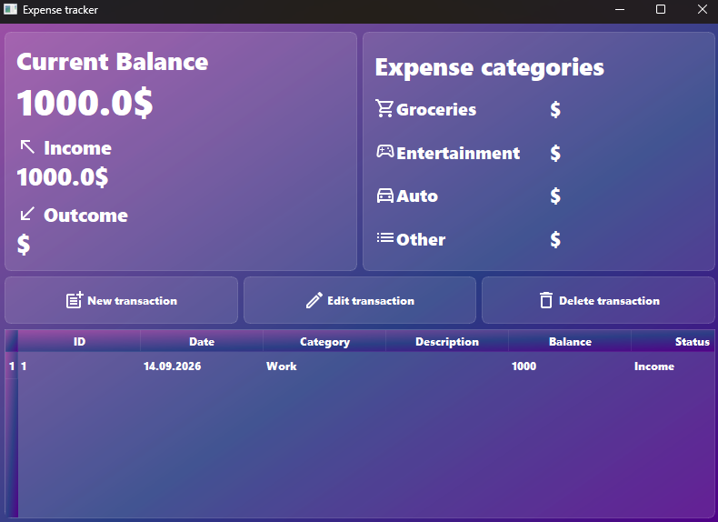

# expense-tracker-pyside6
Income and expense tracker built with Python, PySide6 and SQLite. Educational project based on a YouTube tutorial📊

# Language / 语言 / Язык
[🇬🇧 English](#english) | [🇨🇳 简体中文](#chinese) | [🇷🇺 Русский](#russian)

---

# 💰 Expense Tracker (PySide6 + SQLite)

Welcome to my Expense Tracker project. This is a desktop application built to manage personal finances, allowing users to track income and expenses efficiently. The project was created as part of my learning journey in software development and served as practical experience in GUI programming, database management, and UI integration.

### 🛠️ Tech Stack
* **Language:** Python
* **GUI Framework:** PySide6
* **UI Design:** Qt Designer
* **Database:** SQLite

### ✨ Features
* **Transaction Management:** Add and track income and expense records with categories.
* **View History:** Browse a complete list of all past transactions in a structured table.
* **Balance Calculation:** Automatically calculates the current balance based on income and expenses.
* **Categorization:** Organize expenses by categories such as Groceries, Entertainment, Auto, and more.

### 🚀 How to Run
1. **Install dependencies:**
   pip install -r requirements.txt
2. **Launch the application:**
   python main.py

### 📌 Status
Educational project. Created based on a YouTube tutorial to practice GUI development, working with SQLite databases, and integrating Qt Designer UI files into Python code. The interface was designed in Qt Designer and converted to Python using pyside6-uic.

---

# 💰 记账本 (PySide6 + SQLite)

欢迎来到我的记账本应用项目。这是一个用于管理个人财务的桌面应用程序，允许用户高效地记录收入和支出。该项目是我软件开发学习之旅的一部分，为我提供了 GUI 编程、数据库管理和界面集成方面的实践经验。

### 🛠️ 技术栈
* **编程语言:** Python 3
* **GUI 框架:** PySide6
* **界面设计:** Qt Designer
* **数据库:** SQLite

### ✨ 功能
* **交易管理:** 添加和追踪带有分类的收入与支出记录。
* **历史记录:** 在结构化表格中浏览所有历史交易列表。
* **余额计算:** 根据收入和支出自动计算当前余额。
* **分类功能:** 按类别整理支出，如食品杂货、娱乐、汽车等。

### 🚀 如何运行
1. **安装依赖:**
   pip install -r requirements.txt
2. **启动应用:**
   python main.py

### 📌 状态
教学项目。基于 YouTube 视频教程制作，旨在练习 GUI 开发、SQLite 数据库操作以及将 Qt Designer 界面文件集成到 Python 代码中。界面在 Qt Designer 中设计，并使用 pyside6-uic 转换为 Python 代码。

---

# 💰 Трекер доходов и расходов (PySide6 + SQLite)

Добро пожаловать в мой проект по учету личных финансов. Это настольное приложение, созданное для удобного управления доходами и расходами. Проект был создан в рамках моего обучения разработке и дал практический опыт в программировании GUI, работе с базами данных и интеграции интерфейсов.

### 🛠️ Стек технологий
* **Язык:** Python 3
* **Фреймворк GUI:** PySide6
* **Дизайн интерфейса:** Qt Designer
* **База данных:** SQLite

### ✨ Возможности
* **Управление транзакциями:** Добавление и отслеживание доходов и расходов с категориями.
* **История:** Просмотр полного списка всех прошлых транзакций в структурированной таблице.
* **Подсчет баланса:** Автоматический расчет текущего баланса на основе доходов и расходов.
* **Категории:** Организация расходов по категориям, таким как продукты, развлечения, авто и другие.

### 🚀 Как запустить
1. **Установите зависимости:**
   pip install -r requirements.txt
2. **Запустите приложение:**
   python main.py

### 📌 Статус
Учебный проект. Создан по видеокурсу на YouTube для отработки навыков разработки GUI, работы с базами данных SQLite и интеграции интерфейсов из Qt Designer в Python-код. Интерфейс был создан в Qt Designer и сконвертирован в Python с помощью pyside6-uic.

---

## 🔒 Copyright Info / 版权信息 / Информация об авторских правах

* **EN:** Created as part of a learning process. All rights belong to the author.
* **CN:** 作为学习过程的一部分创建。所有权利归作者所有。
* **RU:** Создано в рамках учебного процесса. Все права принадлежат автору.
